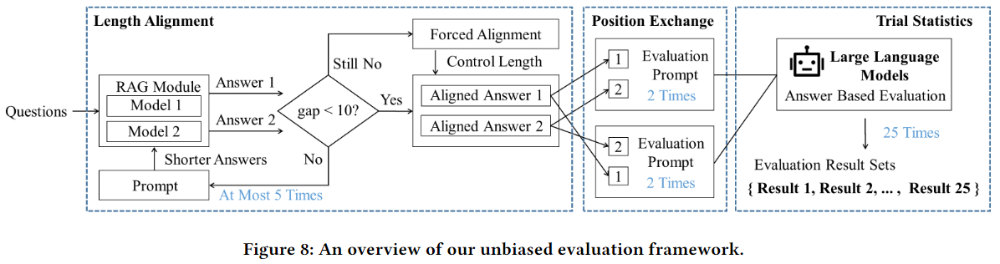
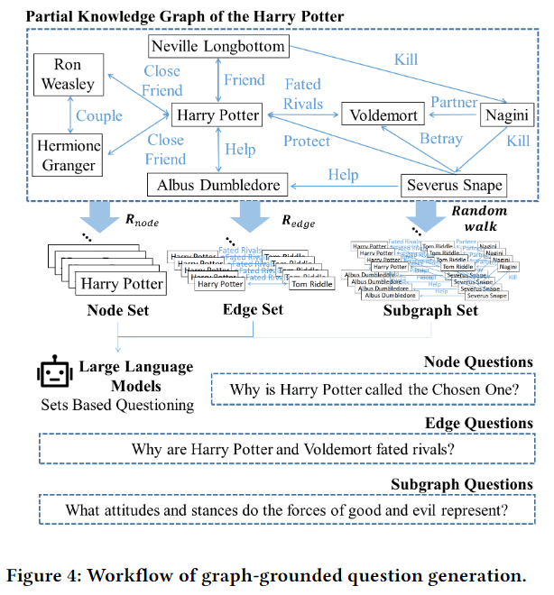

# GraphRAG-Evaluate

An Unbiased Evaluation Framework for GraphRAG



## RAGs

Below are the RAG methods we compare: 

|       RAG          |                    Link                        |
| :----------------: | :--------------------------------------------: |
|  GraphRAG(NanoRAG) | https://github.com/gusye1234/nano-graphrag     |
|       LightRAG     | https://github.com/HKUDS/LightRAG              |
|       NaiveRAG*    | https://github.com/HKUDS/LightRAG              |
|        FastRAG     | https://github.com/circlemind-ai/fast-graphrag |

NaiveRAG*: The NaiveRAG we use is implemented on LightRAG.

## Datasets

The datasets we use are from here: https://huggingface.co/datasets/TommyChien/UltraDomain


## Install

```bash
cd GraphRAG-Evaluate
pip install -r requirements.txt
```

## Quick Usage

### Set API key

Configure in [env.py](env.py).

### Process Data

Data deduplication.

```bash
python ./process_data/duplicate.py \
--input_dir ./datasets \
--output_dir ./datasets/unique_contexts
```

Insert data into graph.

```bash
python ./process_data/insert.py \
--dataset_name mix \
--dataset_path ./datasets/unique_contexts/mix_unique_contexts.json \
--rag_name LightRAG
```

### Generate Question



We use graph information of LightRag to generate questions.

```bash
python ./Q_and_A/generate_question.py --dataset_name mix 
```

### Generate Answer

```bash
python ./Q_and_A/query.py \
--dataset_name mix \
--question_path ./datasets/mix/questions.jsonl  \
--rag_name_1 LightRAG \
--rag_name_2 FastRAG \
--length_gap 10
```

Align answers length again.

```bash
python ./Q_and_A/align_length.py --dataset_name mix
```

### Evaluation

```bash
python ./evaluate/eval_multitimes.py \
--dataset_name mix \
--rag_name_1 LightRAG \
--rag_name_2 FastRAG \
--answer_path ./datasets/mix/answer/LightRAG_and_FastRAG_align.jsonl \
--repet_time 2 \
--evaluate_times 25
```


